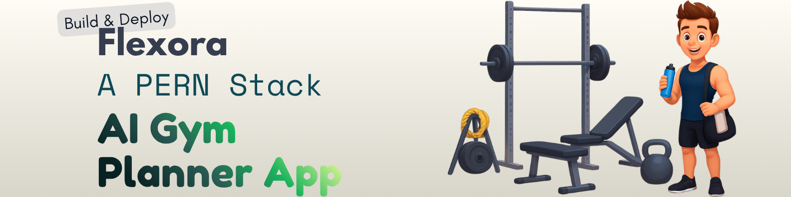

<div align="center">
  <br />
    
  <br />

  <div>
    
    
    
    
    
  </div>

  <h3 align="center">Flexora - An AI Gym Planner App</h3>
</div>

## 📋 <a name="table">Table of Contents</a>

1. 🤖 [Introduction](#introduction)
2. ⚙️ [Tech Stack](#tech-stack)
3. 🔋 [Features](#features)
4. 🤸 [Quick Start](#quick-start)

## <a name="introduction">🤖 Introduction</a>

**Flexora** is an intelligent, **AI-powered Gym Planner Application** designed to revolutionize your fitness journey. With _Flexora_, users can effortlessly generate **personalized workout routines** and **training plans** tailored to their unique fitness goals, experience level, and equipment availability.

Built with a modern and robust technology stack—including **React**, **TypeScript**, **Tailwind CSS**, **Node.js**, and **PostgreSQL**—the application delivers a seamless, highly responsive, and interactive user experience across all devices.

Whether you are a seasoned fitness enthusiast aiming to meticulously track your progress or a complete beginner looking for structured guidance, _Flexora_ serves as your ultimate virtual fitness companion. Say goodbye to generic, one-size-fits-all workout templates, and let artificial intelligence optimize your daily training regime for maximum efficiency, motivation, and results.

## <a name="tech-stack">⚙️ Tech Stack</a>

### Frontend

| Technology           | Version       | Purpose                             |
| -------------------- | ------------- | ----------------------------------- |
| **React**            | 19.2.3        | UI library                          |
| **React-Router-Dom** | 7.13.1        | Routing library                     |
| **TypeScript**       | 5.x           | Type-safe JavaScript                |
| **Tailwind CSS**     | 4.x           | Utility-first CSS framework         |
| **Vite**             | 8.0.1         | Build tool and dev server           |
| **NeonDB**           | 0.2.0-beta.1  | Database for user state persistence |

### Backend & Services

| Technology       | Version      | Purpose                             |
| ---------------- | ------------ | ----------------------------------- |
| **Neon Auth**    | 0.2.0-beta.1 | Authentication & user management    |
| **Express**      | 5.1.0        | Web framework                       |
| **Prisma**       | 7.0.1        | ORM for database management         |
| **OpenAI**       | 6.32.0       | AI plan generation & chat responses |

## <a name="features">🔋 Features</a>

👉 **AI-Powered Gym Plans**: Generate custom workout plans mapped specifically to your goals, experience, and equipment using OpenAI.

👉 **Authentication & Security**: Secure user authentication and session management powered seamlessly by Neon Auth.

👉 **Persistent Progress Tracking**: Safely store user profiles, generated plans, and workout logs dynamically via NeonDB and Prisma ORM.

👉 **Responsive & Modern UI**: A sleek, fully responsive interface built with React and Tailwind CSS, ensuring an optimal experience on both desktop and mobile.

👉 **Fast Performance**: Experience blazing fast rendering, hot module replacement, and optimized build times thanks to Vite and React 19.

👉 **Robust Type Safety**: End-to-end type safety carefully implemented with TypeScript, ensuring high code reliability and significantly decreasing runtime errors.


## <a name="quick-start">🤸 Quick Start</a>

Follow these steps to set up the project locally on your machine.

**Prerequisites**

Make sure you have the following installed on your machine:

- [Git](https://git-scm.com/)
- [Node.js](https://nodejs.org/en)
- [npm](https://www.npmjs.com/) (Node Package Manager)

**Cloning the Repository**

```bash
git clone https://github.com/itzzSVR-tech/Flexora.git
cd Flexora
```

### Frontend

**Installation**

Install the project dependencies using npm:

```bash
npm install
```

**Running the Project**

```bash
npm run dev
```

Open [http://localhost:5173](http://localhost:5173) in your browser to view the project.

### Backend

**Installation**

Install the project dependencies using npm:

```bash
cd server
npm install
```

**Running the Project**

```bash
npm run dev:server
```

[http://localhost:3001](http://localhost:3001) will start running in the background.
